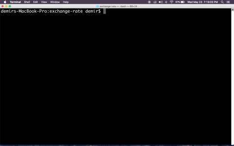

# Exchange Rate



This is a command line application that gives you the currency exchange rates of 170 countries money currencies.

### How to download and run it ?

You can download and run this program in two ways either :
```
$ git clone https://github.com/demirantay/exchange_rate.git
$ cd exchange_rate
$ python exchange_rate.py
```

or you can use chmod +x for a small command prompt

```
$ git clone https://github.com/demirantay/exchange_rate.git
$ cd exchange_rate
$ chmod +x ./exchange_rate.py
$ ./exhange_rate.py  
```

### How do you use it ?

```
$ python exchange_rate.py
$ amount : 1
$ from: usd
$ to: eur
$ 0.854958
```
