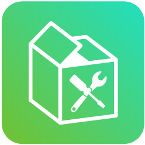

    

<h3 align="center">Tia</h3>

  Command line ORM for RDBMS and NoSQL databases.
   
  <a href="https://github.com/demirantay/tia/blob/master/docs/index.md"><strong>Read the Docs »</strong></a>
   
   
   

tia is a basic ORM that helps you do CRUD operations on your databases on the command line in a fast and easy way. Right now it only supports PostgreSQL, MySQL, SQLite, MongoDB, Redis.

- Documentation : https://github.com/demirantay/tia/blob/master/docs/index.md
- Source-code :https://github.com/demirantay/tia
- PyPi : coming soon ...
- Website : coming soon ...

### Usage

The downloading, build scirpts ... etc. usage and easy set up docs will go here
